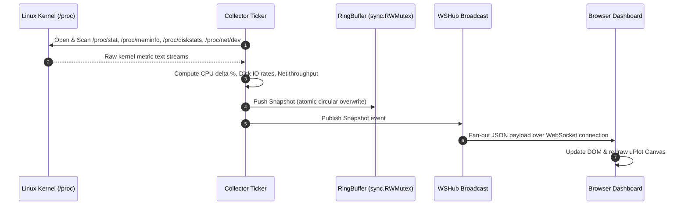

<p align="center">
  
</p>

<h1 align="center">Statix</h1>

<p align="center">
  <strong>Ultra-Low Overhead, Single-Binary Linux System Resource Monitor</strong>
</p>

<p align="center">
  <a href="https://github.com/Woffluon/Statix/releases"></a>
  <a href="https://github.com/Woffluon/Statix/blob/main/LICENSE"></a>
  
  
  
  
  
</p>

---

## Executive Overview

`Statix` is a self-hosted, single-binary Linux system resource monitoring engine written in Go 1.22+. It reads Linux kernel interfaces (`/proc` and `/sys`) directly without intermediate reflection layers or transitive metric libraries.

The binary serves a real-time web dashboard using server-side rendered HTML (`html/template`) and pushes live 2-second metric deltas via WebSocket JSON streams. All static frontend assets (HTML, CSS, JS libraries) are embedded at compile time via `//go:embed`.

```
┌──────────────────────────────────────────────────────────────────────────────┐
│                              Statix Process                                  │
│                                                                              │
│  ┌─────────────┐    Snapshot   ┌────────────────┐   Snapshot   ┌───────────┐ │
│  │  Collector  │ ────────────► │   RingBuffer   │ ───────────► │    WS     │ │
│  │  (ticker)   │               │ (circular buf) │              │    Hub    │ │
│  └──────┬──────┘               └────────────────┘              └─────┬─────┘ │
│         │ /proc                                                      │       │
│         ▼                                                            ▼       │
│  ┌─────────────────────────────────────────────────────────────────────────┐ │
│  │                      chi HTTP Server & Middleware                       │ │
│  │     /healthz   /setup   /login   /dashboard   /ws   /settings/domain    │ │
│  └─────────────────────────────────────────────────────────────────────────┘ │
└──────────────────────────────────────────────────────────────────────────────┘
```

---

## Technical Philosophy & Architecture

### 1. Direct Kernel Parsing
Unlike cross-platform monitoring libraries, Statix parses raw Linux `/proc` text streams directly using stream scanners (`bufio.Scanner` over `io.Reader`). This eliminates memory allocations in hot paths and bypasses Cgo/gopsutil reflection overhead.

### 2. Zero External Runtime Dependencies
Statix compiles to a static binary with `CGO_ENABLED=0`. HTML templates, CSS stylesheets, htmx, Alpine.js, and uPlot libraries are baked directly into the executable.

### 3. In-Memory Ring Buffer Storage
Metrics are stored in a fixed-capacity circular slice guarded by a `sync.RWMutex`. Default allocation stores 6 hours of telemetry (10,800 snapshots) in ~5.4 MB of heap space.

---

## System Architecture Diagram



---

## Kernel Interface Parsing Specifications

| Target Kernel File | Parsed Fields | Mathematical Processing |
| :--- | :--- | :--- |
| `/proc/stat` | `cpu`, `cpu0`..`cpuN` jiffies (`user`, `nice`, `system`, `idle`, `iowait`, `irq`, `softirq`, `steal`) | $\text{CPU\%} = 100 \times \left(1 - \frac{\Delta \text{idle}}{\Delta \text{total}}\right)$ |
| `/proc/meminfo` | `MemTotal`, `MemFree`, `MemAvailable`, `Buffers`, `Cached`, `SwapTotal`, `SwapFree` | $\text{MemUsed} = \text{MemTotal} - \text{MemAvailable}$ |
| `/proc/diskstats` | Major/minor, device, reads completed, sectors read, writes completed, sectors written | $\text{IO Rate} = \frac{\Delta \text{Sectors} \times 512}{\Delta t}$ |
| `/proc/net/dev` | Interface name, RX bytes, RX packets, TX bytes, TX packets | $\text{Throughput Bps} = \frac{\Delta \text{Bytes}}{\Delta t}$ |
| `/proc/[pid]/stat` + `status` | `utime`, `stime`, `starttime`, `VmRSS`, `State`, `Name` | $\text{Proc CPU\%} = \frac{\Delta (\text{utime} + \text{stime}) / 100}{\Delta t} \times 100$ |

---

## Resource Footprint & Benchmark Comparison

| Resource / Feature | Statix | gopsutil-based Exporters | Prometheus Node Exporter |
| :--- | :--- | :--- | :--- |
| **Binary Size** | **~18 MB** (Statically linked) | ~45 MB+ | ~30 MB |
| **RAM Usage** | **~18 MB** (Including 6h history buffer) | ~40 MB | ~35 MB |
| **CPU Usage** | **< 0.1%** (Single core at 2s interval) | ~0.5% | ~0.3% |
| **Runtime Dependencies** | **Zero** | Requires glibc | Requires Prometheus Server |
| **Built-in Storage** | **Yes** (6h in-memory ring buffer) | No | No |
| **Built-in Web Dashboard** | **Yes** (SSR + WebSocket) | No | No |
| **Built-in Let's Encrypt TLS** | **Yes** (Certmagic) | No | No |

---

## Quick Installation

Run the automated systemd installer on any systemd-enabled Linux host:

```bash
curl -sSL https://raw.githubusercontent.com/Woffluon/Statix/main/deploy/install.sh | sudo bash
```

The script automatically detects CPU architecture (`amd64` / `arm64`), downloads the binary release, verifies SHA256 checksums, provisions a unprivileged `statix` system user, and activates the hardened systemd unit.

Once started, open `http://<server-ip>:8080` to complete the first-run setup wizard.

---

## Security Architecture & Specifications

```
  HTTP Request ──► [ RequestLogger Middleware ]
                         │
                         ▼
                   [ Recover Middleware ]
                         │
                         ▼
             [ SecurityHeaders Middleware ] ──► (CSP, HSTS, X-Frame-Options)
                         │
                         ▼
                [ RateLimiter Check ] ────► Lockout (429) if > 5 fails / 15m
                         │
                         ▼
                 [ RequireAuth Cookie ] ───► Redirect /login (302) if invalid
                         │
                         ▼
                [ CSRF Double-Submit ] ───► Reject (403) on mutating POST/PUT
                         │
                         ▼
                 [ Target Handler ]
```

### Security Primitives

- **Password Hashing:** Argon2id with OWASP 2023 compliant parameters:
  - Memory: $64 \text{ MB} = 65,536 \text{ KiB}$
  - Iterations: $3$
  - Parallelism: $2$
  - Salt Length: $16 \text{ bytes}$
  - Key Length: $32 \text{ bytes}$
- **Session Tokens:** 32-byte cryptographically secure random values generated via `crypto/rand`, stored in server memory (`map[string]Session` guarded by `sync.RWMutex`).
- **Cookie Security:** Cookies set with `HttpOnly`, `SameSite=Strict`, and conditionally `Secure` when TLS is active.
- **CSRF Defense:** Double-submit cookie pattern. Mutating HTTP methods (`POST`, `PUT`, `DELETE`) require token verification using `subtle.ConstantTimeCompare`.
- **IP Rate Limiting:** Sliding-window rate limiter tracks consecutive failed login attempts per `IP:Username` tuple. Reaching 5 failures triggers a 15-minute lock.

---

## HTTP & WebSocket API Contract

| Endpoint | Method | Authentication | CSRF Required | Description |
| :--- | :--- | :--- | :--- | :--- |
| `/healthz` | `GET` | Unauthenticated | No | Health check probe returning `{"status":"ok"}` |
| `/setup` | `GET` | Setup Guard | No | First-run setup wizard UI |
| `/setup` | `POST` | Setup Guard | Yes | Process initial admin credentials & config |
| `/login` | `GET` | Unauthenticated | No | Login form UI |
| `/login` | `POST` | Unauthenticated | Yes | Authenticate admin & issue session cookie |
| `/logout` | `POST` | Authenticated | Yes | Revoke session & clear cookies |
| `/dashboard` | `GET` | Authenticated | No | Main system monitoring dashboard |
| `/ws` | `GET` | Authenticated | No | Real-time WebSocket JSON telemetry stream |
| `/settings/domain` | `GET` | Authenticated | No | Domain binding & TLS status UI |
| `/settings/domain` | `POST` | Authenticated | Yes | Initiate ACME domain binding & certmagic |

---

## Hardened Systemd Service Unit (`statix.service`)

```ini
[Unit]
Description=Statix System Resource Monitor
After=network.target

[Service]
Type=simple
User=statix
Group=statix
ExecStart=/usr/local/bin/statix --config /etc/statix/config.yaml
Restart=on-failure
RestartSec=5

# Security Hardening
AmbientCapabilities=CAP_NET_BIND_SERVICE
CapabilityBoundingSet=CAP_NET_BIND_SERVICE
NoNewPrivileges=true
ProtectSystem=strict
ReadWritePaths=/etc/statix
ProtectHome=true

[Install]
WantedBy=multi-user.target
```

---

## Configuration Reference (`/etc/statix/config.yaml`)

```yaml
listen_addr: ":8080"
domain: ""
tls_enabled: false
admin_username: "admin"
admin_password_hash: "$argon2id$v=19$m=65536,t=3,p=2$..."
session_secret: "a3f1b2c3..."
setup_complete: true
collect_interval_seconds: 2
history_duration_hours: 6
log_format: "json"
```

### Config Schema Description

| Key | Type | Default | Description |
| :--- | :--- | :--- | :--- |
| `listen_addr` | string | `:8080` | Bind address and port for HTTP server |
| `domain` | string | `""` | Configured domain name for Let's Encrypt TLS |
| `tls_enabled` | bool | `false` | Status of automatic HTTPS listener |
| `admin_username` | string | `""` | Admin username |
| `admin_password_hash` | string | `""` | Argon2id PHC-formatted password hash |
| `session_secret` | string | `""` | Hex-encoded 32-byte session secret |
| `setup_complete` | bool | `false` | Flag indicating setup wizard completion |
| `collect_interval_seconds`| int | `2` | Metric collection tick interval |
| `history_duration_hours` | int | `6` | Duration of history retained in ring buffer |
| `log_format` | string | `json` | Structured logging format (`json` or `text`) |

---

## Developer & Build Guide

### Prerequisites
- Go 1.22 or higher
- Linux host or WSL (Ubuntu)

### Build Local Binary
```bash
make build
```

### Run Test Suite
```bash
make test
```

### Run Linter
```bash
make lint
```

### Cross-Compile Release Binaries
```bash
make build-all
```

Produces:
- `bin/statix-linux-amd64`
- `bin/statix-linux-arm64`

---

## Repository Structure

```
Statix/
├── cmd/
│   └── statix/
│       └── main.go                 # Application entrypoint & graceful shutdown
├── deploy/
│   ├── install.sh                  # One-command idempotent shell installer
│   └── statix.service              # Hardened systemd unit file
├── internal/
│   ├── auth/                       # Argon2id, session store, CSRF & middleware
│   ├── config/                     # YAML configuration & atomic saver
│   ├── metrics/                    # Linux /proc parsers & ring buffer
│   ├── platform/                   # Low-level procfs stream readers
│   ├── tlsmanager/                 # Certmagic Let's Encrypt integration wrapper
│   └── webui/                      # Server, routing, WSHub & embedded templates
├── website/                        # Promotional Netlify landing page
│   ├── assets/
│   ├── css/
│   ├── js/
│   └── index.html
├── Makefile                        # Build, test, and lint targets
├── netlify.toml                    # Netlify deployment configuration
└── README.md                       # Documentation
```

---

## License

Statix is open-source software released under the [MIT License](LICENSE).
